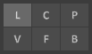
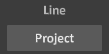

#### Box Mode

Box Mode，简称B，是打开之后的默认模式，它可以绘制长宽高任意的长方体。从按下鼠标的点，到松开鼠标的点，作为长方体的两个对角顶点。

#### Line Mode

Line Mode，简称L，画线模式。选中这个模式之后，Brush面板下方就会多出来一个开关，可以把鼠标移动到这个开关上，从提示栏看到说明：

- Project：投影模式，把直线投影到表面上，那么我们可以在立体的表面增加一条线条，但只是从你的视角看过去是一条线，一旦切换视角……有兴趣可以尝试一下。

- Straight：空间直线，直接穿过立体，构筑一条从起点到中点的直线。

#### Center Mode

Center Mode，简称C，中心模式。选中这个模式以后，可以像直线模式一样改变开关画圆（Circle）画方（Square）。也可以改变画边长/直径为奇数（Odd）或偶数（Even）的圆形或方形。

#### Pattern Mode

Pattern Mode，简称P，模型模式。选中这个模式以后，可以自己定义放置的物体。快捷键：90，↑↓，←→，PageUp PageDown。

#### Vixel Mode

Vixel Mode，简称V，体素模式。这就是3D世界里的画笔模式。可以调节画笔的模式，3D情况下就是字面意思，Sphere（半球）、Cube（立方体），2D情况下对应了圆形和方形；也可以调节画笔的大小，1像素的话是看不出画笔模式的。

#### Face Mode

Face Mode，简称F，面模式。如何定义一个面呢？面模式提供了两种方式确定面：同一个几何面上并且是同一种颜色，仅同一个几何面上；新增的色块用的颜色可以设置，调色板颜色、原本的颜色；而且定义了邻居数，4相邻、8相邻。
