# 如何开始使用Magical Voxel

[TOC]

## 存活下来——什么是Model？

### 提示栏 Toggle Hint

作者非常贴心地准备了一个提示栏，我们把鼠标移动到工具上，就会显示一个简短的说明，以及放置在中括号中的 [快捷键]。

`Toggle Hint 在页面的正下方可以点击小三角打开或关闭`

### 移动视角

如果把鼠标放在中央的模型上，可以看到提示栏（Toggle Hint）上面写了`Rotate(RButton): Move(MButton)`什么意思呢？翻译过来就是改变视角的方法：

- 转动（鼠标右键）
- 移动（鼠标中键）

### 建立形状

`第一次打开Magical Voxel`

如果是第一次打开，会发现有一个`40 40 40` 的立方体，所有的空间都充满了体素（Voxel）；这个时候可以使用笔刷（Brush）的 `Erase` 工具开始第一次作画~Erase工具，顾名思义，橡皮擦，可以把现在充满体素的Model挖去一些小小的空间。

`Brush 界面中默认选中了 Box Mode 和 Erase 工具`

Attach工具就正好相反，**选择右边工具栏中的Tool下的Del全部删除，或者使用Ctrl+A全选、Delete删除**，就可以在空的画板里添加体素啦~

关于Brush下的其他模式介绍，请参阅[modes.md](./help/modes.md)。

### 选择形状

为什么强调选区呢？因为有了选区我们才能对一个体素模型做各种各样的事情，比如放大、缩小、平移、旋转（MV只能90度旋转），当然也可以删除复制粘贴，还有一个神奇的用法是通过选区建立一个**模式（Pattern）**。

左边的Brush除了最明显的三个工具Attach、Erase、Paint，其实还有6个非常好用的工具，前三个和选择相关，这部分主要介绍前三个分别是：

- Move（移动）：快捷键Ctrl+左键
- Box Select（框选）：快捷键N
- Region Select（区域选择）：快捷键M

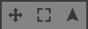

另外选择的过程中，有两个通用的快捷键：在原有快捷键的基础上，增加Shift就是联合选区，增加Alt就是去除选区。

右边的工具栏里还有一些按钮可以帮助我们选择，它被收集在一个叫做Select的小盒子里，点一下就能展开，一共是以下六个小工具：

- All（全选）：快捷键Ctrl+A
- Inv（反选）：快捷键Ctrl+I
- None（取消选区）：快捷键Ctrl+D
- Copy（复制）：快捷键Ctrl+C
- Cut（剪切）：快捷键Ctrl+X
- Paste（粘贴）：快捷键Ctrl+V

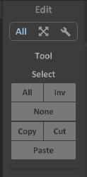

功能也正如它们的字面意思，快捷键也和其它软件保持一致，非常便于使用和记忆。

### 编辑形状

选择好之后，可以开始编辑了，大家可以自由发挥，并且试用一下这些功能~

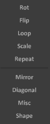

其中Misc（杂项）里包括了形态学处理膨胀和腐蚀哦~

### 建立专属调色板

直到现在，模型居然还是初始默认的蓝色！我相信从一开始就反感这个现象的同学已经找到了解决方法，选择左边颜色框中的颜色，然后有了花花绿绿的世界。不过不要高兴太早，如果从一开始就对颜色的使用没有好好规划的话，后期将是一键相当痛苦的事情。所以，这一节我们从一个不起眼的小功能——默认调色板，开始讲起。

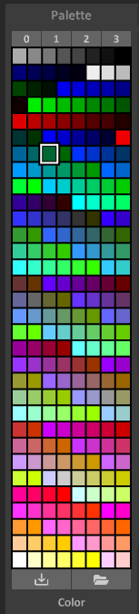

`pal0的默认配色`

左边Palette（调色板）栏的最上方，可以看到0123四个栏目。这是什么呢？这是四种预置调色板，这四个调色板对应的是软件安装目录下 ./palette/palx.png （x=0123分别对应软件中的四个栏目），可以通过更换调色板对做好的作品一键换色。

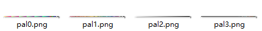

`调色板`

之所以能实现一键换色，实际上是因为涂色涂的是调色板上的位置，而不是其对应的颜色。也就是说，更换调色板的时候，第一行第一列的颜色会换到另一个调色板的第一行第一列的颜色。所以同一个作品中不能使用多个调色板上的颜色，如果一个作品使用多个调色板，就好像为这个作品设定了多个主题，可以直接更换。

这也意味着我们分享作品也要分享调色板。软件的作者已经为我们想到这点了，所以在保存作品的时候会保存调色板，打开作品的时候会打开调色板。

**注意**：打开作品打开的调色板不会放在pal0、pal1这样的文件中，如果在刚刚打开作品的时候就换调色板，那么相当于对作品进行重新上色，除非撤销，否则将是不可复原的。

## 更大一点——World Editor供你自由发挥

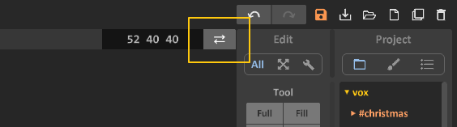

不断创作、不断突破，就总会遇到Model模式下模型最大为126\*126\*126的限制，为大家介绍一个功能，在任何情况下按下Tab即可打开“World Editor”，世界模式。

### 基本功能

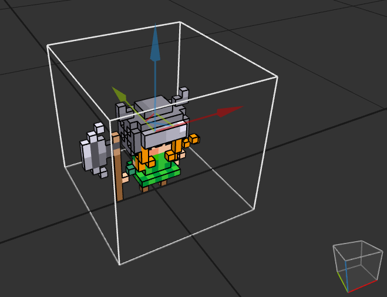

`拖拽坐标轴颜色的箭头来平移`

这个模式下，每个Model都是一个组成部分，不同的Model可以移动（拖动坐标轴，按照坐标轴平移），但是不能直接编辑。想要编辑只要选中对应的模型，然后按下Tab即可。

也可以把之前做好的模型粘贴（Ctrl+V）进来，但是一定要注意调色板，粘贴进来的模型会被这个世界的调色板染色。所以在做世界级的模型的时候，第一步应当是设计合适的调色板，当然，颜色应有尽有的pal1也是一个不错的选择。

### 工具箱

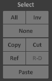

`实用的Copy-Paste在“Select”选项卡中`

可以用一个Model为参考制作新模型（Ref），这样只要修改其中一个剩下的就都会改变；也可以用一个Model制作很多副本（Copy），这样改变其中一个剩下的还会保持不变；还可以把参考模型转换成一般的副本（R-D）。

### 图层

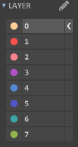

`图层可以自定义名称`

在世界模式中还有“图层”的概念，可以把模型设置到对应的图层，从而批量隐藏，这样可以自由调节想要显示的部分模型，比较遗憾，现在的版本（MagicaVoxel-0.99.2-alpha-win64）还不支持增加或删除图层，而且需要手动设置模型所在图层。

## 更好看点——在Render中渲染！

之前说过，调色板一定要精心设计，因为每一个格子不仅仅代表一种颜色，还包括了材质，令人垂涎的半透明材质也在这里。

### 调整材质

选择对应的颜色格子（可以用Pick工具，快捷键Alt+左键），打开Render，即可调节材质啦。材质有以下四种：

* Diffuse：普通材质，没有任何选项；
* Metal：金属材质，对应反光性能；
* Galss：玻璃材质，对应透明性质；
* Emission：发光材质，对应发光性能。

具体的参数调节就看爱好啦~

### 调整模式

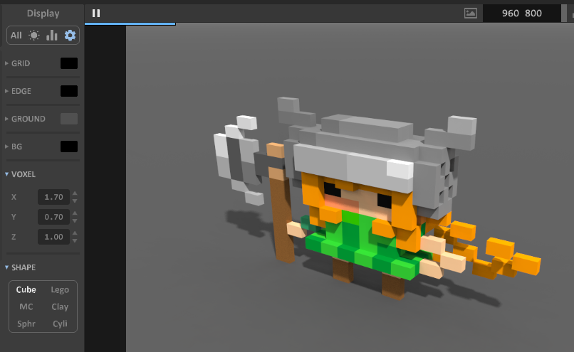

在设置中的前几个选项，可以修改默认的天和地的颜色；“VOXEL”选项中可以把体素变成长方体；“SHAPE”选项，可以设置不同的像素类型，立方体是最基础的类型，设置成MC和Clay会显得圆润一些。

但是调节像素类型的时候需要注意，前面的“材质”，只能用在Cube中。

### 调节光影

光线可以设置全局光（Unif）和自然光（Atom），类型改变后，可以调节的参数也会随着而变。

这是我做的一个三不猴的模型，里面就用了全局光：

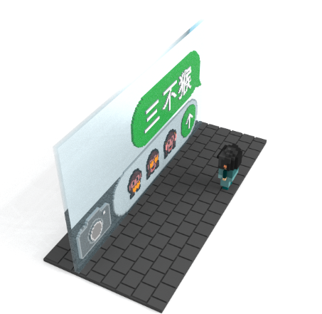
