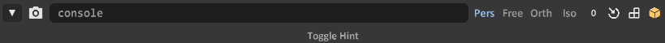
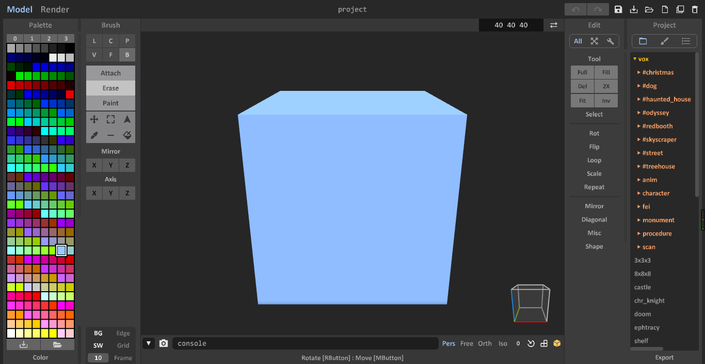
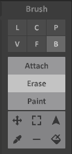

# 如何开始使用Magical Voxel

## 存活下来——什么是Model？

### 提示栏 Toggle Hint

作者非常贴心地准备了一个提示栏，我们把鼠标移动到工具上，就会显示一个简短的说明，以及放置在中括号中的 [快捷键]。

`Toggle Hint 在页面的正下方可以点击小三角打开或关闭`

### 建立形状

`第一次打开Magical Voxel`

如果是第一次打开，会发现有一个`40 40 40` 的立方体，所有的空间都充满了体素（Voxel）；这个时候可以使用笔刷（Brush）的 `Erase` 工具开始第一次作画~Erase工具，顾名思义，橡皮擦，可以把现在充满体素的Model挖去一些小小的空间。

`Brush 界面中默认选中了 Box Mode 和 Erase 工具`

Box Mode

Box Mode是打开之后的默认模式，它可以绘制长宽高任意的长方体。从按下鼠标的点，到松开鼠标的点，作为长方体的两个顶点。

Line Mode

### 编辑形状

### 建立专属调色板

### 更大一点

## 更好看点——在Render中渲染！

### 调整材质

### 调整模式

### 调节光影